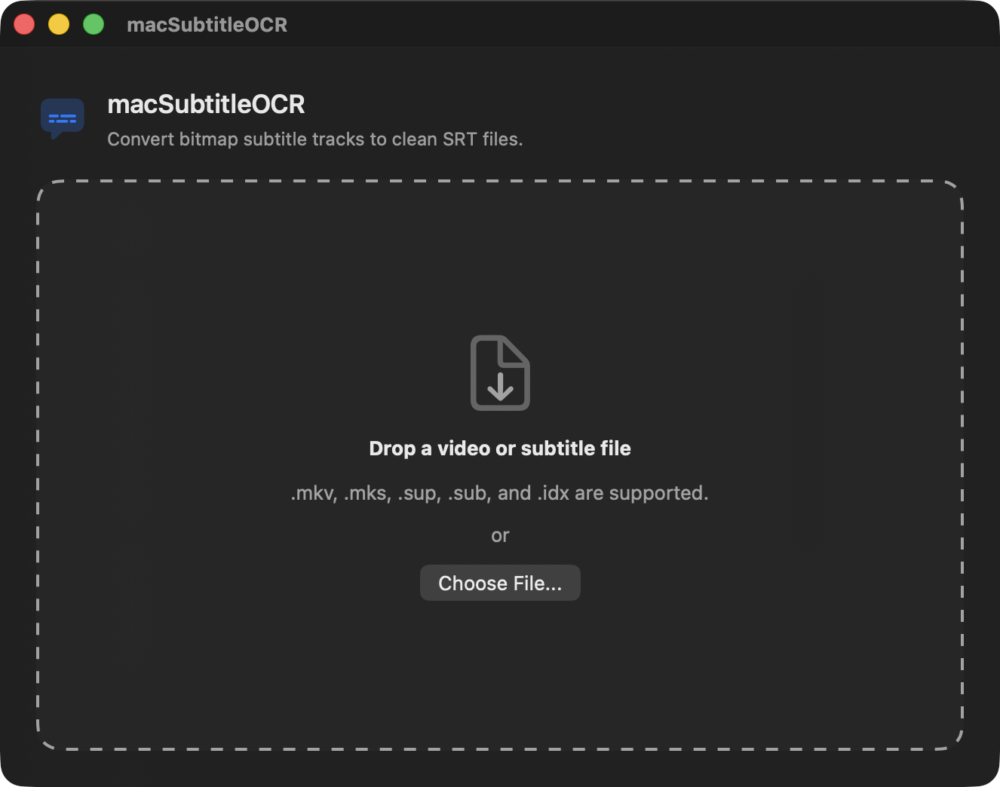
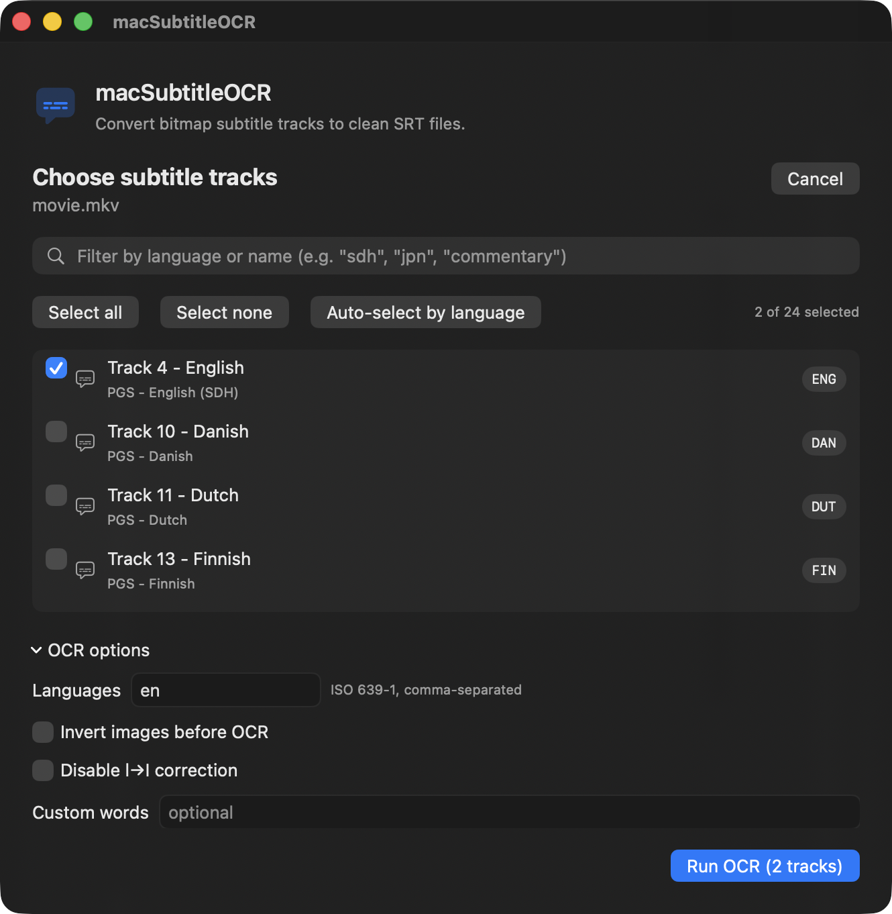

# macSubtitleOCR-gui

A polished SwiftUI front-end for [macSubtitleOCR](https://github.com/ecdye/macSubtitleOCR).
Drop a `.mkv`, `.sup`, `.sub`, or `.idx` file, pick one or more PGS / VobSub
tracks, and get clean `.srt` files next to your source — ready to mux into
MP4 soft-subs with [Subler](https://subler.org) or your tool of choice.

[](https://github.com/jeffalldridge/macSubtitleOCR-gui/actions/workflows/ci.yml)
[](https://github.com/jeffalldridge/macSubtitleOCR-gui/releases/latest)
[](LICENSE)


By Jeff Alldridge / [Tent Studios, LLC](https://tentstudios.com). The
underlying OCR engine is [macSubtitleOCR](https://github.com/ecdye/macSubtitleOCR)
by Ethan Dye, MIT-licensed.

---

## What it looks like

| Drop screen | Track picker |
|---|---|
|  |  |

---

## Why this exists

`macSubtitleOCR` is the best macOS-native PGS-to-SRT tool there is — it uses
Apple's Vision framework so OCR quality is meaningfully better than Tesseract.
But its CLI runs OCR on **every** subtitle track in an MKV, which is rarely
what you want when you're cutting a single language for a release.

This GUI:

- Probes the file and shows every PGS / VobSub track with its language and
  name (so a Wonka remux's "English (SDH)" / "Italian (Commentary)" /
  "Japanese (Sing-Along)" tracks are obvious at a glance).
- Lets you pick **exactly the tracks you want** — multi-select, with
  filter-by-language for big files.
- Runs OCR with a real progress UI and a cancel button.
- Writes each output as `MyFilm.<lang>[.<sanitized-track-name>].srt` next to
  your source — `MyFilm.eng.english-sdh.srt`, `MyFilm.jpn.japanese-commentary.srt`.
- Shows a preview of the first cues so you can sanity-check OCR quality
  before you mux.
- Persists your last-used language, invert flag, and custom-words across
  sessions.

---

## Install

### Option 1 — download the signed `.dmg`

Grab the latest `.dmg` from the
[Releases page](https://github.com/jeffalldridge/macSubtitleOCR-gui/releases/latest),
double-click to mount, drag the app to `/Applications`. The release is signed
with a Developer ID and notarized by Apple, so it launches with no Gatekeeper
warning.

### Option 2 — build from source

```sh
git clone --recurse-submodules https://github.com/jeffalldridge/macSubtitleOCR-gui
cd macSubtitleOCR-gui
brew install mkvtoolnix
make app
open build/macSubtitleOCR-gui.app
```

The first build compiles macSubtitleOCR from source (slow); subsequent builds
reuse the cache.

---

## Requirements

- macOS 14 (Sonoma) or newer
- Apple Silicon (M-series). Intel users can build from source; the published
  `.dmg` is arm64-only for v0.1.
- [MKVToolNix](https://mkvtoolnix.download): `brew install mkvtoolnix` —
  used at runtime to read MKV track metadata and extract the chosen track.
  The app surfaces a one-tap install card if it's missing.

---

## Workflow

1. Drag a `.mkv` / `.sup` / `.sub` / `.idx` file onto the window (or
   `Choose File…` / `⌘O`).
2. The app probes for subtitle tracks and shows them with their codec,
   language, and any track-name metadata. SDH / Commentary / Sing-Along
   variants are clearly labeled.
3. Tick the tracks you want (one or many). Tweak language, invert flag, or
   custom words in **OCR options** if needed.
4. Hit **Run OCR**. Watch progress; expand the Log if you want.
5. Each track gets its own `.srt` next to your source. The Done screen
   shows a preview of the first cues from each output, with one-click
   reveal-in-Finder.

---

## Building, testing, releasing

```sh
make build      # compiles upstream macSubtitleOCR + this app
make run        # builds and runs straight from the terminal
make app        # assembles build/macSubtitleOCR-gui.app (3.6 MB, ad-hoc signed)
make dmg        # packages the .app into a drag-to-/Applications .dmg
make test       # runs the Swift Testing suites (40+ tests)
make clean      # wipes build artifacts
```

For a notarization-ready build (requires an Apple Developer account):

```sh
DEV_ID="Developer ID Application: Your Name (TEAMID12345)" make notarize
```

That re-signs with hardened runtime + your Developer ID, submits to Apple's
notary service, and staples the ticket. See [`Makefile`](Makefile) for the
one-time `notarytool store-credentials` setup.

The CI workflow (`.github/workflows/ci.yml`) builds and tests on every push.
Release builds (`.github/workflows/release.yml`) trigger on `v*.*.*` tag
pushes, sign + notarize + package + publish to GitHub Releases.

---

## Architecture (one-liner per piece)

- **`TrackProber`** — runs `mkvmerge -J` and parses subtitle tracks
- **`MKVToolNixExtractor`** — pulls a single track to a temp `.sup` / `.idx`
  via `mkvextract`
- **`OCRRunner`** — invokes the bundled `macSubtitleOCR` binary, streams
  log output and exit status as `AsyncStream` events
- **`SRTFinalizer`** — names and moves the resulting SRT next to the input;
  sanitizes track name into the filename
- **`SubtitleJob`** — `@Observable` state container driving the four-phase UI
  (Drop → Tracks → Run → Done)
- **`ToolchainProbe` / `BundledBinary`** — locate `mkvtoolnix` /
  `macSubtitleOCR` at runtime, preferring the `.app` bundle over any system
  install

The full design rationale lives at
[`docs/specs/2026-04-30-macSubtitleOCR-gui-design.md`](docs/specs/2026-04-30-macSubtitleOCR-gui-design.md).
The Path 3 roadmap for an upcoming bitmap preview + scrubber is at
[`docs/roadmap/track-preview-scrubber.md`](docs/roadmap/track-preview-scrubber.md).

---

## Updating the upstream OCR engine

The repository pins `Vendor/macSubtitleOCR` to a specific upstream tag for
reproducible builds. To bump it:

```sh
make update                 # pulls latest from upstream/main, rebuilds
git add Vendor/macSubtitleOCR
git commit -m "Bump macSubtitleOCR to <upstream-sha>"
```

After a new upstream release tag, you can also do
`git -C Vendor/macSubtitleOCR checkout v1.2.3` to lock to that version
specifically.

---

## Contributing

PRs welcome. See [`CONTRIBUTING.md`](CONTRIBUTING.md) for setup, the
test/build checklist, and what kinds of changes fit the project.

For security issues, see [`SECURITY.md`](SECURITY.md) — please don't open
public issues.

---

## Credits

- **macSubtitleOCR** by Ethan Dye — the OCR engine and the PGS / VobSub
  decoders that do all the actual work. MIT-licensed.
- **MKVToolNix** by Moritz Bunkus and contributors — `mkvmerge` and
  `mkvextract`. GPL-2.0-or-later. Not bundled; used at runtime.
- **Apple Vision framework** — text recognition.
- **Apple SF Symbols** — the `captions.bubble` symbol used in the icon
  composition (Icon Composer source at [`Resources/icon.icon`](Resources/icon.icon)).

Full attribution and license texts in
[`THIRD_PARTY_LICENSES.md`](THIRD_PARTY_LICENSES.md).

---

## License

MIT, same as upstream macSubtitleOCR. © 2026 Jeff Alldridge / Tent Studios, LLC.
